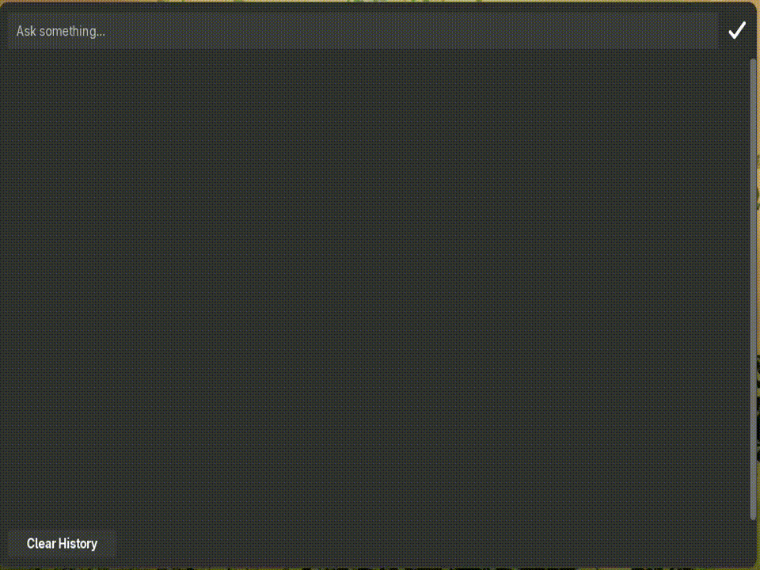
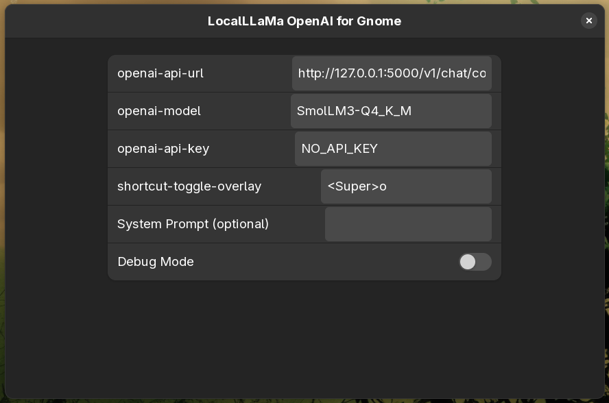
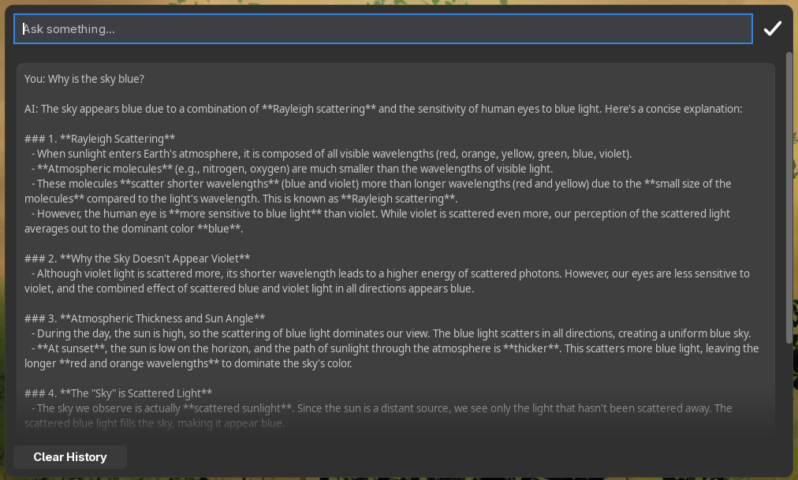

# LocalLLaMa - ChatGPT / OpenAI GNOME Extension





## LocalLLaMa - ChatGPT Overlay for GNOME Shell

---

This is a simple extension that uses the OpenAI API to display a LocalLLaMa - ChatGPT Overlay by pressing `Super + o`.
Forked from [metix gnome-shell-extension-openai](https://github.com/metix/gnome-shell-extension-openai) to be LocalLLaMa friendly (eg. llama.cpp)

Note: API-Key is **not** required for this extension. Defaults to 'NO_API_KEY'.

---

#### Features

- Supports Light/Dark Mode
- Settings UI : openai-api-url, openai-model, openai-api-key, shortcut-toggle-overlay, system prompt.
- Clear History (Shortcut: CTRL+L)
- Optional System Prompt (Initial prompt for all questions)

## Install From Source

This method installs to your `~/.local/share/gnome-shell/extensions` directory from the latest source code on the main
branch.

Clone this repository:

```bash
git clone https://github.com/ali0une/gnome-shell-extension-openai && cd gnome-shell-extension-openai
```

Install the extension:

```bash
make install
```

Restart desktop:

- On X11: `ALT+F2` then type `r`
- On Wayland: Log-out and Log-In again

Enable the extension:

```bash
gnome-extensions enable openai-gnome@ali0une.org
```

Open the settings dialog and paste your OpenAI-API-Key:

```bash
gnome-extensions prefs openai-gnome@ali0une.org
```

Show the overlay with the shortcut:

```
-> Super+o to show the overlay
```

## Settings

You can configure some settings in the UI:

| Name          | Example Value | Description                                                                                                                                                                                                                                     |
|---------------|----------------|-------------------------------------------------------------------------------------------------------------------------------------------------------------------------------------------------------------------------------------------------|
| Open-Api-Key  | NO_API_KEY     | Default to `NO_API_KEY`. You can set your OpenAI key.                                                                                                                                                                                         |
| System-Prompt | Act as a Stackoverflow post | The initial message that is added before each conversation. ([Read more](https://platform.openai.com/docs/guides/chat/instructing-chat-models)). It is sent in the background and will not be visible in your chat. |
| Debug-Mode    | false          | Development‑only setting. When enabled, no API calls are made; a placeholder message is shown as the response.                                                                                                                             |

## Compatibility

The Extension was tested on:

- Ubuntu 22.04, X11, GNOME Shell 42.5
- Ubuntu 23.04, Wayland, GNOME Shell 43.2
- Debian 12, X11, GNOME Shell 43.9

Feel free to contribute if you found bugs or improved something.

## FAQ

#### Where can I get an OpenAI API-Key?

First you need to create an Account on [OpenAI](https://openai.com/blog/openai-api).

From your user profile, you can manage your API keys by selecting "Manage API Keys".

## Troubleshooting

- Restart GNOME Shell (`ALT+F2`, then type `r`)
- Look for error messages in

```
journalctl /usr/bin/gnome-shell
```

## License

This Extension has been released under The GNU General Public License v3.0.
